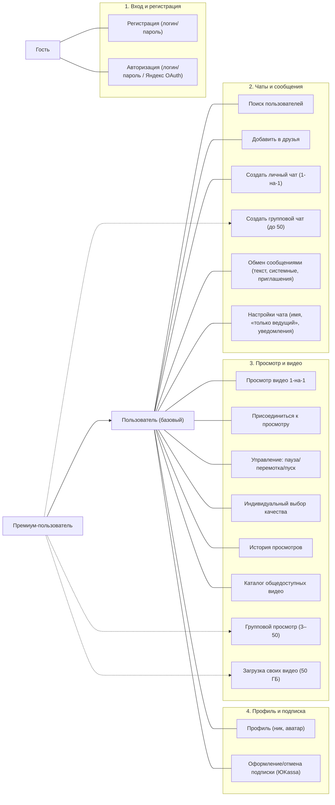
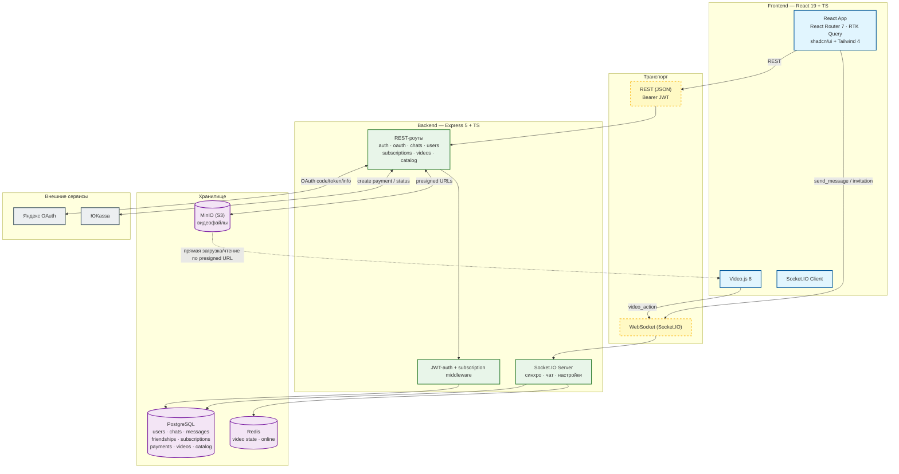
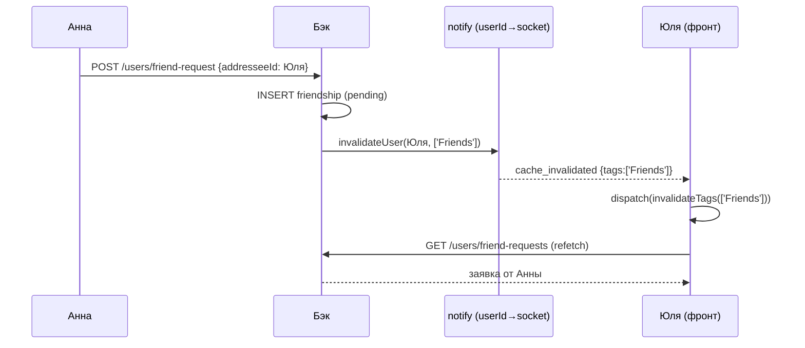
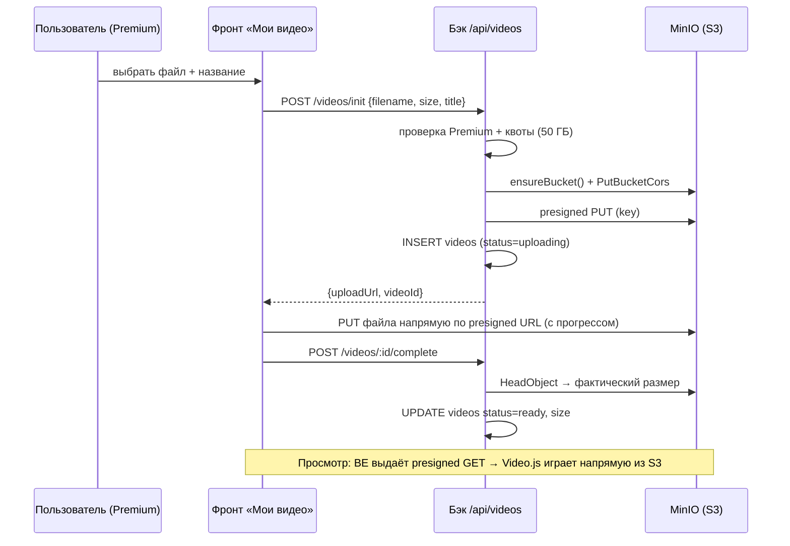

# WatchTogether

**Суть проекта:** веб-сервис, объединяющий мессенджер и совместный просмотр видео с покадровой синхронизацией воспроизведения.

---

## Актуальность / Проблема

Сейчас площадки, где можно общаться и смотреть видео-трансляции (Discord, Telegram), заблокированы. Discord режет качество трансляций и управлять потоком может только хост; Telegram — чисто мессенджер. WatchTogether даёт совместный просмотр с высоким качеством и точной синхронизацией + встроенный чат.

## Целевая аудитория

- **Анна** хочет посмотреть фильм с подругой из другого города — Discord заблокирован, другие площадки режут качество.
- **Иван** снимает/оцифровывает видео с праздников — ему удобно пересылать их в чате и смотреть вместе с заказчиками, обсуждая правки.

**Вывод:** люди, которые хотят смотреть видео без потери качества и рассинхрона и обсуждать его во время просмотра.

## Монетизация

Основной функционал (мессенджер, просмотр 1-на-1) бесплатен. Групповой просмотр (3+ человека) и загрузка своих видео требуют подписки.

**Тарифы (реализовано):**


| План         | Цена         | Ключевое                                                                                       |
| ------------ | ------------ | ---------------------------------------------------------------------------------------------- |
| **Free**     | 0 ₽          | Личные чаты 1-на-1, просмотр вдвоём, каталог, индивидуальный выбор качества                    |
| **Premium**  | 299 ₽ / мес  | Групповые чаты (до 50 участников, до 5 групп), загрузка видео (50 ГБ), синхронизация для групп |
| **Premium+** | 2499 ₽ / год | Безлимит групповых чатов, всё из Premium                                                       |


Оплата — интеграция с ЮKassa (тестовый режим).

---


## Пользовательские сценарии (User Stories)

1. **US-01** Авторизоваться через Яндекс, чтобы не регистрироваться. — ✅ *(VK осознанно не подключали: VK ID требует https для redirect_uri, что неудобно для локальной разработки. Реализован вход через Яндекс.)*
2. **US-02** Найти друга по нику и создать чат для совместного просмотра. — ✅
3. **US-03** Вставить ссылку на видео **или загрузить файл** и нажать «Смотреть вместе». — ✅ *(и каталог общедоступных видео)*
4. **US-04** Писать сообщения в чат рядом с видео. — ✅
5. **US-05** Запустить просмотр в беседе (3+ человека) как премиум-пользователь. — ✅
6. **US-06** Пауза/перемотка у одного участника синхронизируется у остальных. — ✅

---


## Use Case Diagram




---


# Архитектура


## Стек

**Frontend** (`wathtogether_projet_frontend`):
React 19 + TypeScript, Vite 8, Redux Toolkit + **RTK Query**, React Router 7, **Socket.IO Client 4**, **Video.js 8** (видеоплеер, `qualityLevels` для HLS), Tailwind CSS 4, shadcn/ui (Radix), lucide-react.

**Backend** (`watchtogether_project_backend`):
Node.js + **Express 5** + TypeScript, **Socket.IO 4**, **PostgreSQL** (через `pg`), **Redis** (`ioredis`), JWT (`jsonwebtoken`), bcryptjs, multer (аватары), **AWS SDK v3** (`@aws-sdk/client-s3` + `s3-request-presigner`) для S3-совместимого хранилища.

**Инфраструктура:** Docker Compose — PostgreSQL, Redis, **MinIO** (S3-совместимое хранилище для видео).

**Внешние сервисы:** Яндекс OAuth (авторизация), ЮKassa (платежи).

## Архитектурная схема




**Ключевые потоки:**

- **REST (RTK Query)** — аутентификация, профиль, чаты, друзья, подписки/платежи, видео-квота, каталог. JWT в `Authorization: Bearer`, авто-рефрейм 401 → `/login`.
- **WebSocket (Socket.IO)** — синхронизация видео, обмен сообщениями, онлайн-счётчик, настройки комнаты в реальном времени.
- **S3 (presigned)** — фронт льёт и читает видео **напрямую** в MinIO по временным подписанным ссылкам, бэк их только подписывает (не гоняет трафик через себя).

---


# Схема БД

Миграции: `db/01…09_*.sql` (PostgreSQL 15).

- **users** `id, username (uniq), email (uniq, nullable), password_hash (nullable — для OAuth), role (user/premium/premium_plus), avatar_url, created_at, yandex_id (uniq partial)` — привязка аккаунта Яндекса.
- **chats** `id, name, type (private/group), created_by → users, created_at, host_only_controls, allow_video` — настройки уровня чата (управляет создатель).
- **chat_participants** `chat_id → chats, user_id → users, joined_at, notify_messages, notify_video, sound_enabled, show_participants` — PK(chat_id, user_id); индивидуальные настройки участника.
- **messages** `id, chat_id, user_id → users, content, type (text/system/watch_invitation), created_at, video_url` — системные сообщения о действиях с видео и приглашения на просмотр.
- **friendships** `id, requester_id, addressee_id, status (pending/accepted/rejected), created_at` — заявки в друзья.
- **subscriptions** `id, user_id, plan (free/premium/premium_plus), status (active/cancelled/expired), start_date, end_date, auto_renew, created_at, updated_at` — триггер на `updated_at`. Жизненный цикл: `active` → `cancelled` (отмена, доступ до `end_date`) → `expired` (ленивый даунгрейд при чтении, `expireIfNeeded`).
- **payments** `id, yookassa_payment_id (uniq), user_id, plan, amount, status (pending/succeeded/canceled), created_at` — история платежей ЮKassa.
- **videos** `id, user_id, title, s3_key, size, content_type, status (uploading/ready/error), created_at` — загруженные пользователями видео.
- **catalog_videos** `id, title, description, video_url (uniq), poster_url, created_at` — общедоступный каталог (не привязан к пользователям).

---


# REST API


| Группа            | Метод · путь                                                                  | Назначение                                                     |
| ----------------- | ----------------------------------------------------------------------------- | -------------------------------------------------------------- |
| **auth**          | `POST /api/auth/register`                                                     | Регистрация (логин/email/пароль, bcrypt)                       |
|                   | `POST /api/auth/login`                                                        | Логин, выдача JWT (24ч)                                        |
|                   | `GET /api/auth/me`                                                            | Текущий пользователь                                           |
| **oauth**         | `GET /api/auth/yandex`                                                        | Редирект на Яндекс (state-кука)                                |
|                   | `GET /api/auth/yandex/callback`                                               | Обмен code→token→профиль, find-or-create, JWT                  |
| **chats**         | `POST /api/chats`                                                             | Создать чат (group — только Premium)                           |
|                   | `GET /api/chats` · `GET /api/chats/:id`                                       | Список / один чат                                              |
|                   | `PATCH /api/chats/:id`                                                        | Переименовать, `host_only_controls`, `allow_video` (создатель) |
|                   | `GET /api/chats/:id/messages`                                                 | Сообщения чата                                                 |
|                   | `GET/POST/DELETE /api/chats/:id/participants`                                 | Участники (лимиты по подписке)                                 |
|                   | `POST /api/chats/:id/join`                                                    | Вступить в групповой чат по ссылке                             |
|                   | `GET/PATCH /api/chats/:id/settings`                                           | Индивидуальные настройки участника                             |
| **users**         | `GET /api/users/search`                                                       | Поиск по нику/email                                            |
|                   | `POST/PATCH /api/users/friend-request`                                        | Заявка в друзья / accept·reject                                |
|                   | `GET /api/users/friend-requests` · `GET /api/users/friends`                   | Входящие заявки / друзья                                       |
|                   | `DELETE /api/users/friends/:id`                                               | Удалить из друзей                                              |
|                   | `GET/PATCH /api/users/me` · `POST /api/users/avatar`                          | Профиль, смена ника, аватар                                    |
|                   | `GET /api/users/history`                                                      | История (чаты с сообщениями)                                   |
| **subscriptions** | `GET /api/subscriptions/my`                                                   | Текущая подписка                                               |
|                   | `POST /api/subscriptions/upgrade`                                             | Активация напрямую (админка/тесты)                             |
|                   | `POST /api/subscriptions/cancel`                                              | Отмена (доступ сохраняется до конца периода)                   |
|                   | `POST /api/subscriptions/create-payment`                                      | Создать платёж в ЮKassa                                        |
|                   | `GET /api/subscriptions/payment-status`                                       | Статус последнего pending-платежа                              |
| **videos**        | `GET /api/videos/quota`                                                       | Использовано / лимит (50 ГБ), is_premium                       |
|                   | `GET /api/videos` · `POST /api/videos/init` · `POST /api/videos/:id/complete` | Список / начало (presigned PUT) / завершение загрузки          |
|                   | `DELETE /api/videos/:id` · `GET /api/videos/:id/play-url`                     | Удаление / presigned GET                                       |
| **catalog**       | `GET /api/catalog`                                                            | Общедоступные видео                                            |


---


# Socket.IO события

**Клиент → Сервер:**

- `join_chat {chatId}` · `leave_chat {chatId}`
- `send_message {chatId, content}`
- `video_action {chatId, action: play|pause|seek, time}`
- `send_watch_invitation {chatId, videoUrl, username}`
- `send_reaction {chatId, emoji}` — эфемерная реакция (не хранится)
- `chat_settings_changed {chatId, host_only_controls}`

**Сервер → Клиент:**

- `chat_info {onlineCount, totalParticipants}` · `joined_chat {chatId}`
- `receive_message {id, user_id, username, avatar_url, content, created_at, type, video_url?}`
- `sync_video {action, time, userId}` · `initial_video_state {action, time}`
- `reaction {emoji}` — реакция от другого участника
- `cache_invalidated {tags: [...]}` — сигнал перезапросить данные (см. «Реактивность»)
- `invitation_sent {…}` · `chat_settings_updated {chatId, host_only_controls}`
- `error {message}`

Авторизация сокета — по `auth.token` (тот же JWT). На `join_chat`, `send_message`, `video_action`, `send_reaction` проверяется членство в чате; на `video_action` — ещё и per-user кулдаун (см. «Синхронизация»).

---


# Реактивность через сокет (cache_invalidated)

Вместо поллинга и «рефетча по фокусу вкладки» сервер сам сообщает клиенту, что данные протухли. На бэке ведётся реестр `userId → socketId` (`src/socket/notify.ts`); при изменении данных сервер шлёт пострадавшему пользователю (или всей комнате чата) событие `cache_invalidated { tags }`. Клиент на уровне приложения слушает его и делает `dispatch(apiSlice.util.invalidateTags(tags))` — RTK Query сам перезапрашивает затронутые запросы.

- **Друзья:** отправка / accept / reject / удаление → `invalidateUser(второй_пользователь, ['Friends'])`.
- **Состав чата:** добавление участника → добавленному `['Chats']` (чат появляется в сайдбаре) + всей комнате `['ChatParticipants']`; вступление по ссылке и выход → комнате `['ChatParticipants']`.




---


# Синхронизация воспроизведения

**Логика:**

- Действие `play/pause/seek` → фронт шлёт `video_action`; бэк проверяет членство и режим «только ведущий», сохраняет состояние в Redis (`room:{chatId}:video_state`, TTL 24ч), рассылает `sync_video` остальным и пишет системное сообщение («X поставил видео на паузу» / «X перемотал на MM:SS» / «X включил видео»).
- Опоздавший на `join_chat` получает `initial_video_state` из Redis и выравнивается.
- Режим **«только ведущий»** (`host_only_controls`): не-создатель не может слать `video_action` (бэк отклоняет, фронт отключает контролы плеера + показывает индикатор).
- **Конкурентные действия:** per-chat кулдаун с привязкой к автору — если другой участник действует в течение 300 мс после чужого действия, бэк отклоняет и шлёт `error` «Подождите, выполняется предыдущая команда» (фронт показывает уведомление). Свою же серию (пауза→перемотка→воспроизведение) бэк не блокирует.
- **«Ожидание участников»:** до первого `play` (или получения `initial_video_state`) поверх плеера показывается экран ожидания.
- Защита от эха: локальное применение удалённого действия идёт под флагом `isApplyingRemoteAction`.

```mermaid
sequenceDiagram
    participant Anna as Анна (хост)
    participant FA as Фронт Анны
    participant WS as Socket.IO (бэк)
    participant PG as PostgreSQL
    participant RDS as Redis
    participant FY as Фронт Юли

    Anna->>FA: Нажимает «Пауза»
    FA->>WS: video_action {chatId, action:"pause", time}
    WS->>PG: проверка членства + host_only
    WS->>RDS: room:chatId:video_state = {pause, time} (TTL 24h)
    par рассылка остальным
        WS-->>FY: sync_video {action:"pause", time, userId}
        FY->>FY: player.currentTime(time); player.pause()
    end
    WS->>PG: INSERT system message «Анна поставил видео на паузу»
    WS-->>FY: receive_message (system)
    WS-->>FA: receive_message (system)
```


---


# Внешние сервисы


## 1. Яндекс OAuth (авторизация)

Authorization Code flow через бэкенд. Локально работает по `http://localhost` (Яндекс разрешает loopback-редиректы).

```mermaid
sequenceDiagram
    participant U as Пользователь
    participant FE as Фронт (:5173)
    participant BE as Бэк /api/auth/yandex
    participant Y as oauth.yandex.ru
    participant YI as login.yandex.ru
    participant DB as PostgreSQL

    U->>FE: «Войти через Яндекс»
    FE->>BE: GET /api/auth/yandex
    BE->>BE: state = UUID, setCookie oauth_state (httpOnly)
    BE-->>FE: 302 → oauth.yandex.ru/authorize?response_type=code&client_id&redirect_uri&state
    U->>Y: логин + согласие
    Y-->>BE: 302 /api/auth/yandex/callback?code&state
    BE->>BE: проверка state vs cookie (CSRF)
    BE->>Y: POST /token {grant_type=authorization_code, code, client_id, client_secret}
    Y-->>BE: access_token
    BE->>YI: GET /info  (Authorization: OAuth access_token)
    YI-->>BE: {id, login, default_email, default_avatar_id}
    BE->>DB: find-or-create по yandex_id / email; скачать аватар
    BE->>BE: jwt.sign({userId, role}, 24h)
    BE-->>FE: 302 /oauth/success?token=<jwt>
    FE->>FE: saveToken → /chats
```


**Эндпоинты Яндекса:** `https://oauth.yandex.ru/authorize`, `https://oauth.yandex.ru/token`, `https://login.yandex.ru/info`.
**Защита:** `state` в httpOnly-куке (CSRF); `client_secret` только на бэке; слияние аккаунтов по `yandex_id`/`email`.

## 2. ЮKassa (платежи)

Redirect-confirmation + проверка статуса pull-ом после возврата (без вебхуков — работает локально без публичного URL). Тестовый магазин.

```mermaid
sequenceDiagram
    participant U as Пользователь
    participant FE as Фронт
    participant BE as Бэк /api/subscriptions
    participant YK as api.yookassa.ru
    participant DB as PostgreSQL

    U->>FE: выбрать план → «Оплатить»
    FE->>BE: POST /create-payment {plan}
    BE->>YK: POST /v3/payments\n(Idempotence-Key, Basic shopId:secret,\nconfirmation=redirect, return_url)
    YK-->>BE: {id, status:"pending", confirmation.confirmation_url}
    BE->>DB: INSERT payments (pending)
    BE-->>FE: {confirmation_url}
    FE->>YK: window.location = confirmation_url
    U->>YK: оплата тестовой картой (5555 5555 5555 4444)
    YK-->>FE: 302 → return_url (/subscription?payment=return)
    FE->>BE: GET /payment-status (JWT)
    BE->>YK: GET /v3/payments/{id}
    YK-->>BE: {status}
    alt status = succeeded
        BE->>DB: payments → succeeded (атомарно);\nактивировать подписку (plan, даты, role)
    end
    BE-->>FE: {status, plan}
```


**Эндпоинты ЮKassa:** `POST https://api.yookassa.ru/v3/payments`, `GET …/payments/{id}`. **Авторизация:** HTTP Basic `shopId:secretKey`. **Идемпотентность:** заголовок `Idempotence-Key` (UUID). **Тестовая карта:** `5555 5555 5555 4444`, срок — любая будущая дата, CVC — `000`.

## 3. MinIO / S3 (хранение видео)

S3-совместимое API через AWS SDK v3. Фронт грузит и читает видео **напрямую** по presigned-ссылкам; бэк только создаёт бакет, настраивает CORS и подписывает URL. Замена MinIO на любое облако (R2, Yandex Object Storage, AWS) — одной переменной `S3_ENDPOINT`.




**Особенности интеграции:** `forcePathStyle: true` для MinIO; отключены авточекпаммы SDK (`requestChecksumCalculation/responseChecksumValidation: WHEN_REQUIRED`) — иначе MinIO отвечает `501 NotImplemented`; CORS бакета разрешает браузерные PUT/GET с фронта; presigned PUT (1ч) и GET (2ч).

---


# Покрытие требований (MoSCoW)


| Требование                                            | Статус | Примечание                                                                           |
| ----------------------------------------------------- | ------ | ------------------------------------------------------------------------------------ |
| **MUST** Регистрация/логин                            | ✅      | bcrypt + JWT 24ч                                                                     |
| **MUST** Личный чат и беседа                          | ✅      | Личный — всем; групповой — только Premium (по модели монетизации)                    |
| **MUST** Поиск друзей + добавление                    | ✅      |                                                                                      |
| **MUST** Синхропросмотр 1-на-1 (пауза/перемотка/пуск) | ✅      |                                                                                      |
| **MUST** Синхрочат при просмотре                      | ✅      |                                                                                      |
| **MUST** Индивидуальный выбор качества                | 🟡     | Работает для HLS (`qualityLevels`); для одиночного MP4 — только «Авто»               |
| **MUST** Долгоживущая сессия                          | ✅      | JWT 24ч                                                                              |
| **SHOULD** OAuth (VK/Яндекс)                          | 🟡     | Только Яндекс (VK ID требует https)                                                  |
| **SHOULD** Групповой просмотр 3+                      | ✅      | До 50, Premium                                                                       |
| **SHOULD** Платежи (тестовые)                         | ✅      | Реальная ЮKassa, тестовый режим                                                      |
| **SHOULD** Загрузка видео                             | ✅      | S3/MinIO, presigned, квота 50 ГБ                                                     |
| **SHOULD** Настройка профиля (ник, аватар)            | ✅      | + валидация ника                                                                     |
| **SHOULD** Присоединение к чату по ссылке/ID          | ✅      | Deep-link `/chats/:id` + кнопка «Поделиться» в шапке чата (копирует ссылку)          |
| **SHOULD** Системные сообщения о действиях            | ✅      | пауза/пуск/перемотка/смена режима                                                    |
|                                                       |        |                                                                                      |
| **COULD** Кастомизация профиля                        | 🟡     | Только аватар + ник                                                                  |
| **COULD** История просмотров                          | 🟡     | Список чатов с сообщениями (без прогресса просмотра)                                 |
| **COULD** Всплывающие реакции                         | ✅      | Эфемерные: транслируются через сокет (`send_reaction`→`reaction`), без хранения в БД |
| **COULD** Ролевая модель в комнате                    | ✅      | «Только ведущий» (host_only_controls)                                                |
| **COULD** Поиск/каталог видео                         | ✅      | Каталог + поиск по названию                                                          |


**WON'T HAVE:** мобильное приложение, live-трансляции, голосовые/видео-чаты.


# Нефункциональные требования

- **Производительность:** сообщения и синхро-события — через WebSocket (цель ≤ 500 мс); группы до 50.
- **Безопасность:** JWT, bcrypt (10 раундов), проверка членства в чате на сокет-событиях, CSRF-`state` в OAuth, идемпотентность платежей, пресигнед-URL для S3 вместо проксирования.
- **Хранилище видео:** S3-совместимое (MinIO локально), не в БД.

---


# Перспективы развития

Реферальная программа; пакеты доп. ГБ; полная ролевая модель (админ/стример/модератор/зритель); приоритетная поддержка Premium; нативное мобильное приложение; рекомендации и плейлисты; логирование и аналитика.