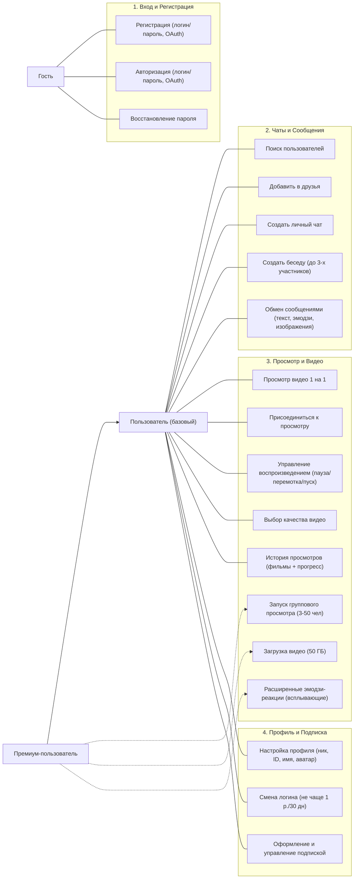
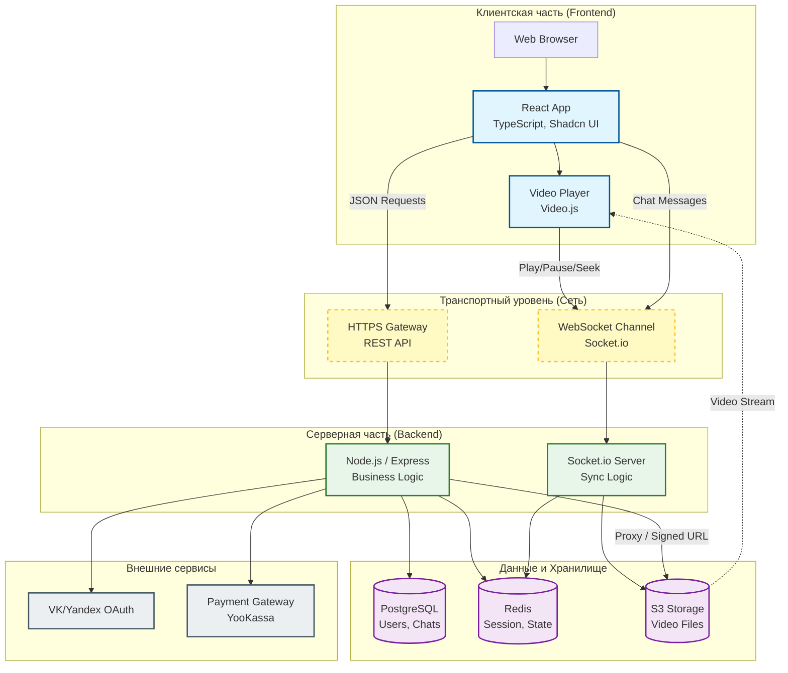
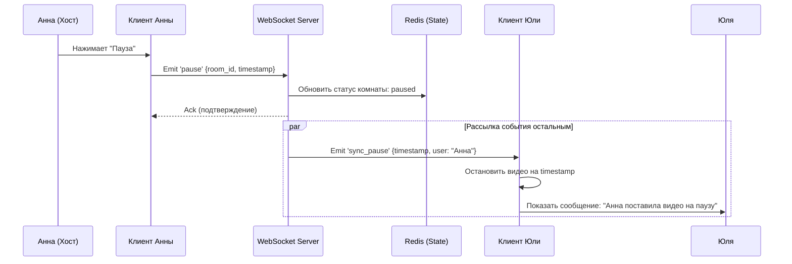

# Название проекта: WatchTogether

**Суть проекта:** веб-сервис, который включает в себя мессенджер и совместный просмотр видео.

## Актуальность / Проблема
Сейчас площадки, где можно общаться и смотреть видео трансляции, типа Discord и Telegram, заблокированы. Конечно, Discord и Telegram имеют свои направления, Discord всё же больше про общение, звонки и видеосвязь, но там так же есть трансляции, в которых сильно режется качество и управлять потоком может только хост. Telegram же чисто мессенджер. Наш сервис даёт возможность совместного просмотра с высоким качеством и синхронизацией, плюс встроенный чат.

## Целевая аудитория
*   **Анна** хочет посмотреть с подругой фильм, но подруга живёт в другом городе, использовать Discord она не может в силу блокировки, а другие площадки режут качество. Она ищет площадки для просмотра видео с друзьями и находит наш сервис, который предоставляет такую возможность и мессенджер.
*   **Иван** снимает или оцифровывает видео с праздников. Ему удобно пересылать их в сервисе в виде чата и просматривать вместе с заказчиками или друзьями, чтобы сразу обсуждать для дальнейших правок.

**Вывод:** целевая аудитория сервиса — люди, которые хотят просматривать видео без потери качества и рассинхрона, обсуждать фильм/видео во время просмотра.

## Монетизация
Основной функционал (мессенджер, просмотр фильмов в беседе 1-на-1) не требует платы. Групповой просмотр (3+ человека), загрузка видео на сайт будут требовать подписки (нужно отбивать занимаемое пространство видео в БД). Рассматриваются разные планы подписки. Дополнительные идеи по монетизации вынесены в раздел «Перспективы развития».

## Пользовательские сценарии (User Stories)
1.  **US-01:** Как пользователь, я хочу авторизоваться через VK/Yandex, чтобы не тратить время на регистрацию.
2.  **US-02:** Как пользователь, я хочу найти друга по нику и создать с ним чат, чтобы организовать вечер совместного просмотра.
3.  **US-03:** Как пользователь, я хочу вставить ссылку на видео (или загрузить файл) и нажать «Смотреть вместе», чтобы мы с другом видели одну и ту же картинку.
4.  **US-04:** Как пользователь, я хочу писать сообщения в чат рядом с видео, чтобы обсуждать фильм без переключения вкладок.
5.  **US-05:** Как премиум-пользователь, я хочу запустить просмотр в беседе (3+ человек), чтобы организовать онлайн-киносеанс для компании друзей.
6.  **US-06:** Как пользователь, я хочу, чтобы при паузе/перемотке видео у одного участника, оно делало то же самое у остальных, чтобы сохранить эффект присутствия.

## Детальные пользовательские истории (Путь пользователя)

1.  **Анна хочет посмотреть фильм с подругой:**  
    Зашла на сайт → авторизовалась (логин/пароль или OAuth VK/Яндекс) → нашла чат с подругой → нажала кнопку для приглашения на совместный просмотр → выбрала фильм → смотрят фильм и обсуждают его в чате.

2.  **Юлю позвали смотреть фильм:**  
    Зашла на сайт → авторизовалась → увидела уведомление о приглашении на совместный просмотр → присоединилась → смотрят и обсуждают.

3.  **Иван:**  
    Зашёл на сайт → зарегистрировался → друзей у Ивана не оказалось. Он может:
    *   загрузить своё видео в личное пространство (если оформлен Premium) и смотреть один с возможностью ставить закладки;
    *   открыть каталог общедоступных фильмов/ссылок и смотреть в одиночном режиме;
    *   отправить ссылку на видео себе в избранное, чтобы позже пригласить друга.

4.  **Анна и Юля с друзьями:**  
    Создали беседу → добавили туда всех участников → чтобы запустить просмотр в беседе, нужна подписка → Анна перешла в раздел с подпиской, выбрала план и оплатила → запустила просмотр в беседе → все вместе смотрят фильм.

### Управление воспроизведением несколькими участниками
*   **Анна** ставит видео на паузу — у всех пауза, в чат автоматически приходит сообщение: «Анна поставила видео на паузу».
*   **Юля** перематывает на 10 минут назад — синхронизация для всех, сообщение в чате: «Юля перемотала видео на 10:00 назад».
*   **Иван** меняет качество видео под свой интернет — это индивидуальная настройка, не влияющая на синхронизацию остальных.
*   При одновременных действиях двух участников система выполняет первое поступившее действие, а на второй клик возвращает уведомление «Подождите, выполняется предыдущая команда». Кнопки на фронте временно блокируются (debounce ~300 мс), чтобы избежать дублирования запросов.

---

# Use Case Diagram



### Описание ролей
*   **Гость:** Регистрация (логин/пароль, OAuth), Авторизация (логин/пароль, OAuth), восстановление пароля.
*   **Пользователь (базовый):** Поиск пользователей, добавление в друзья, создание личных чатов и бесед (до 3-х участников в бесплатном режиме), обмен сообщениями (текст, эмодзи, изображения), просмотр видео 1 на 1, присоединение к просмотру, управление воспроизведением (пауза/перемотка/пуск) – доступно любому участнику, если не включён режим «Только ведущий», индивидуальный выбор качества видео, история просмотров (список фильмов с прогрессом), настройка профиля (ник, ID, имя, аватар; логин можно менять не чаще раза в 30 дней), оформление подписки и управление ею.
*   **Премиум-пользователь:** всё из базового, плюс: запуск группового просмотра (3–50 человек), загрузка своих видео на сервер (выделенные 50 ГБ), расширенные эмодзи-реакции (всплывающие над видео).

### Структура тарифов

**Free:**
*   Личные чаты, просмотр 1 на 1, базовые смайлики.
*   Индивидуальный выбор качества видео.

**Premium (Хост):**
*   Создание «комнат» для 3+ человек (до 50).
*   Загрузка своих видео на сервер (лимит 50 ГБ).
*   Расширенные эмодзи-реакции (всплывающие над видео).
*   Покупка дополнительных ГБ разовыми платежами (в перспективе).
*   Управление подпиской: отображение срока действия, истории платежей.

---

# Архитектурная схема

**Стэк:** React (TypeScript), Node.js (Express), React Router, Redux, Shadcn UI / Ant Design (или другой UI kit), Video.js / Plyr React (видеоплеер), WebSocket (socket.io / ws), PostgreSQL, Redis.  
**Сторонние сервисы:** VK OAuth, Яндекс OAuth, облачное хранилище для загруженных видео (S3-совместимое), интеграция с платёжным шлюзом (тестовый Юкасса или другие).



---

# Схема взаимодействия при синхронизации

**Описание логики:**
*   Пользователь заходит в комнату по Room ID. Видео не стартует автоматически — ожидается, пока кто-либо (или хост) нажмёт Play. Отображается статус «Ожидание участников».
*   Создатель комнаты становится администратором.
*   Ролевая модель (MVP): администратор может включить режим «Только ведущий», при котором управление воспроизведением (пауза, перемотка) доступно только ему. Остальные участники по умолчанию могут управлять, если ограничение не включено.
*   Системные сообщения в чате: «Иван поставил видео на паузу», «Анна включила видео», «Юля перемотала на 01:23:45», «Анна изменила режим: только ведущий».



---

# Требования

## 1. Функциональные требования (MoSCoW)

### MUST HAVE:
*   Регистрация/логин (включая восстановление пароля).
*   Создание личного чата и беседы.
*   Поиск друзей + добавление.
*   Синхронизированный просмотр видео для 2 человек (пауза, перемотка, пуск).
*   Синхронизированный чат при просмотре.
*   Индивидуальный выбор качества видео каждым участником.
*   Долгоживущая сессия (чтобы не разлогинивало во время просмотра).

### SHOULD HAVE:
*   OAuth-интеграция (VK / Яндекс).
*   Групповой просмотр (3+ человека).
*   Платежи (тестовые) — ежемесячная/годовая подписка.
*   Загрузка собственных видео.
*   Настройка профиля (ник, аватар).
*   Присоединение к чату по прямой ссылке/ID.
*   Системные сообщения о действиях с видео в чате.

### COULD HAVE:
*   Рекомендации фильмов.
*   Кастомизация профиля (расширенные аватарки, стикеры).
*   История просмотров.
*   Всплывающие реакции (как в Discord).
*   Плейлист.
*   Ролевая модель в комнате (администратор ограничивает управление).
*   Поиск видео/фильма в каталоге.

### WON'T HAVE (в MVP):
*   Мобильное приложение (только адаптивный веб).
*   Live трансляции (прямые эфиры с веб-камеры или захватом экрана).
*   Голосовые/видео чаты.

## 2. Нефункциональные требования

### Производительность:
*   Сообщения в чате доставляются ≤ 500ms.
*   Пауза/перемотка до отражения у всех участников — цель ≤ 500ms.
*   Группы до 50 пользователей должны работать стабильно.

### Масштабируемость:
*   Старт: поддержка 100–1000 активных пользователей.
*   WebSocket-сервер обеспечивает параллельную работу нескольких комнат.

### Безопасность:
*   HTTPS.
*   JWT-токены.
*   Хеширование паролей (bcrypt).
*   Корректная настройка CORS.

### Доступность видео:
*   Хранение загруженных видео — S3-совместимое облачное хранилище (не в БД).

---

# Перспективы развития и маркетинговые гипотезы
*   **Реферальная программа:** бонусы за приглашение друзей (бесплатный групповой просмотр, дополнительные ГБ). Награды за приглашение 10 друзей (уникальные стикерпаки, расширенные эмодзи-реакции).
*   **Дополнительная монетизация:** пакеты дополнительных ГБ сверх лимита Premium, платные голосовые чаты, транскрибация голосовых сообщений, перевод сообщений в реальном времени.
*   **Ролевая модель полная:** администратор, стример, модератор, зритель с гибкими правами.
*   **Приоритетная поддержка для Premium:** чат с техподдержкой/тикет-система (в перспективе).
*   **Мобильное приложение:** нативное приложение под iOS/Android.
*   **Интеграция с каталогами фильмов:** поиск, рекомендации, плейлисты.
*   **Логирование системы и сбор статистики:** для отладки и аналитики поведения пользователей.
```